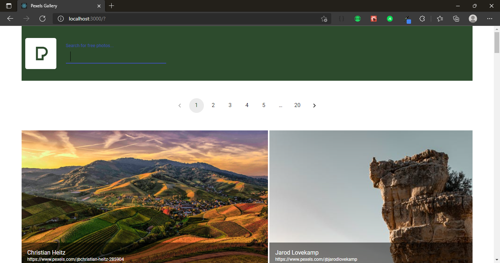

<div align="center">
  

<p align="center">
  
</p>

<h1 align="center">
Pexel Clone Project
</h1>

<p align="center">Projeto diciplicar.</p>

## Participantes

[Luciano Ribeiro](https://github.com/lucianorbr)

## Tecnologias

- [x] React.js
- [x] Styled Components
- [x] TypeScript
- [x] Material-UI

## Inicializar o projeito

```bash
# Clone this repository
$ git clone https://github.com/lucianorbr/PexelsReactJS
# Access the repository
$ cd PexelsReactJS
# Install the dependencies
$ yarn install
# Run application
$ yarn dev
```

## O Projeito
- Minha tarefa consiste em criar um site para um álbum de fotos:
- Ele deve ser responsivo, e suas fotos devem ser carregadas da API https://www.pexels.com/api/documentation/#photos;
- As fotos devem ter paginação(lazy load é um bom caminho ;) mas não é obrigatório );
O site deve conter um cabeçalho e um rodapé;

  